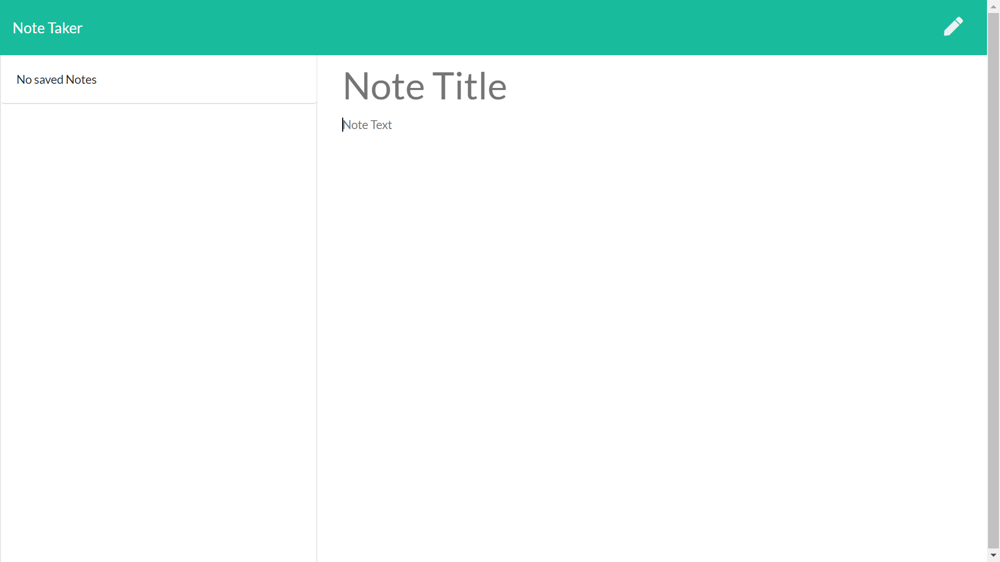

# Note Taker App
Link to my App: https://ericparknotetaker.herokuapp.com/

## Description:
This app is used to take notes. The user will be able to add notes to their application and save them. They will be able to revisit old notes and delete them as they need to. 

## Installation
The repo can be found at the page below. Users can clone the folder from github, run npm i in the terminal, and then run node server.js. 
https://github.com/E-Park8/notetaker

## Usage:
To use this application click on the Get Started button. You can then give a note a title and text and press the save icon to add it to your saved notes. Clicking the pencil icon also clears the current note you are on. Clicking the trash icon will delete the note. 

